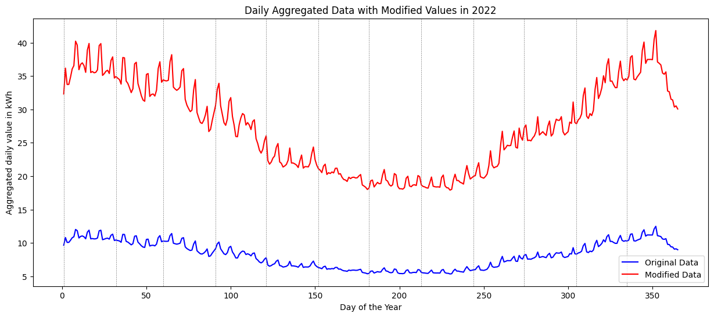

# Aplikace TDD v praxi (za rok 2022)

## Naša domácnost (dvojbyt)
- TDD 5, D25d, jistič 1x25 A 
- TDD 5, D25d, jistič 3x25 A

Dohromady aggregovaná spotreba cca 10MWh za rok 2022 (6 ľudí)

## Predpokladany diagram spotreby v 2022 (asi by som to nemal aggregovať)
- Suma TDD 5 Praha podle OTE =  2986.52 kWh
- Suma TDD 5 Praha podle nás = 10000.00 kWh
- Násobiteľ = 3.348376139265987

### Analýza z celoročného pohľadu
- v zime sa spotrebuje viac (kúrenie)
- v lete sa spotrebuje menej (dovolenky)

## Diagram zatížení den s max/min spotrebou
- Podľa TDD 5 Praha OTE 

### Analýza max-min dennej spotreby (hodiny nie sú úplne správne fitnuté, lebo počas roka prebiehajú rôzne zmeny času, ktoré danú hodinu ovlivňujú)
- Maximálna spotreba bude na konci roku. Ešte nie sú sviatky, takže bežia fabriky. Je zima, takže sa vykuruje. Ľudia pravdepodobne už začínajú piecť na sviatky.
- Peak o 2 bude pravdepodobe v realite niekedy okolo polnoci. Pravdepodobne sa zapne kúrenie alebo sa ľudia pred spaním sprchujú, takže ide ohrev vody.
- Peak o 13 bude obed, všetci idú papať, takže sa spúšťajú ohrevy, rúry, mikrovlnky, ohrevy vody
- Minimálny graf spotrey je v podstate rovnaký len je shifted(zmena času medzi letom a zimou) a peaks sú mnohonásobne menšie (nejde kúrenie + dovolenky)